  

  
  &nbsp;
  
  &nbsp;
  

### A little about me

I'm **GrazT**. I build **software, products, and AI tools** — from Vietnamese input software and social apps to retrieval assistants and computer vision systems.

I enjoy turning ideas into useful applications, bringing together thoughtful interfaces, reliable engineering, and AI where it helps.

### Selected work

<table>
  <tr>
    <td width="50%" valign="top">
      <h3><a href="https://github.com/dinhgia2106/VIMEK">VIMEK</a></h3>
      
A Vietnamese input method with integrated AI, bringing intelligent assistance to everyday typing.

      
<code>Vietnamese input</code> <code>AI</code>

    </td>
    <td width="50%" valign="top">
      <h3><a href="https://tila.asia/">TILA</a></h3>
      
A social app for sharing moments, building habits, and taking on daily challenges with close friends.

      
<code>Flutter</code> <code>Social</code> <code>Habits</code>

    </td>
  </tr>
  <tr>
    <td width="50%" valign="top">
      <h3><a href="https://github.com/dinhgia2106/FPTU_RAG">FPTU RAG</a></h3>
      
An AI assistant for university information, combining vector retrieval with multi-hop question answering.

      
<code>RAG</code> <code>FAISS</code> <code>Flask</code>

    </td>
    <td width="50%" valign="top">
      <h3><a href="https://github.com/dinhgia2106/OCR">Text recognition</a></h3>
      
A two-stage OCR pipeline: detect text regions with YOLOv11, then recognize their contents with CRNN.

      
<code>Computer vision</code> <code>YOLOv11</code> <code>CRNN</code>

    </td>
  </tr>
</table>

### Toolkit

  
  
  
  

  
  
  
  
  

### GitHub at a glance

<!-- The local activity card is refreshed by GitHub Actions with PROFILE_STATS_TOKEN.
     The bootstrap card is explicitly public-only until that secret is configured.
     Language statistics use public repositories and exclude Jupyter Notebook. -->

  
  

  Language percentages reflect repository code size.

 

  <b>Let's build something useful.</b> 
  Ideas, experiments, and collaborations welcome.

