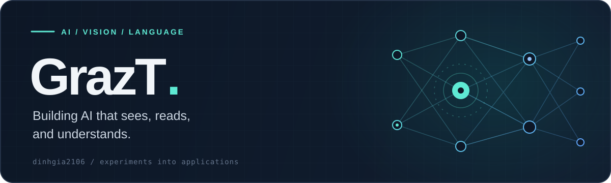

  

  
  &nbsp;
  
  &nbsp;
  

### A little about me

I'm **GrazT**. I build AI projects across **computer vision**, **natural language processing**, and **deep learning** — from retrieving useful answers to reading text in images.

My work brings together models, data pipelines, and applications. Here are a few things I've built.

### Selected work

<table>
  <tr>
    <td width="50%" valign="top">
      <h3><a href="https://github.com/dinhgia2106/FPTU_RAG">FPTU RAG</a></h3>
      
An AI assistant for university information, combining vector retrieval with multi-hop question answering.

      
<code>RAG</code> <code>FAISS</code> <code>Flask</code>

    </td>
    <td width="50%" valign="top">
      <h3><a href="https://github.com/dinhgia2106/OCR">Text recognition</a></h3>
      
A two-stage OCR pipeline: detect text regions with YOLOv11, then recognize their contents with CRNN.

      
<code>Computer vision</code> <code>YOLOv11</code> <code>CRNN</code>

    </td>
  </tr>
  <tr>
    <td width="50%" valign="top">
      <h3><a href="https://github.com/dinhgia2106/Visual-Question-Answering">Visual question answering</a></h3>
      
Connecting images and language with CNN + LSTM and ViT + RoBERTa models to answer questions about images.

      
<code>Multimodal AI</code> <code>ViT</code> <code>RoBERTa</code>

    </td>
    <td width="50%" valign="top">
      <h3><a href="https://github.com/dinhgia2106/Helmet-detect-by-YOLOv10">Helmet detection</a></h3>
      
An object detection project using YOLOv10, covering data preparation, training, inference, and evaluation.

      
<code>Object detection</code> <code>YOLOv10</code>

    </td>
  </tr>
</table>

### Toolkit

  
  
  
  
  

### GitHub at a glance

<!-- Public repository statistics. Notebook containers are excluded from the language breakdown. -->

  
  

  Language percentages reflect repository code size.

 

  <b>Let's build something useful.</b> 
  Ideas, experiments, and collaborations welcome.

